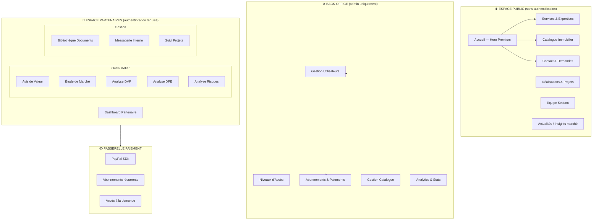
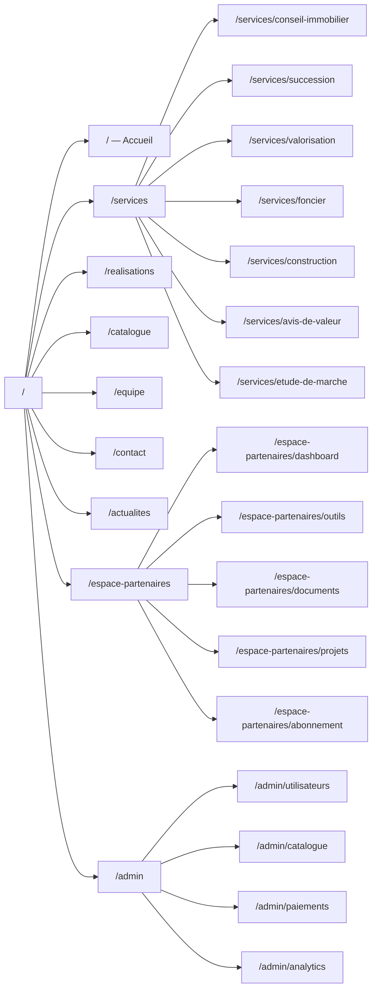
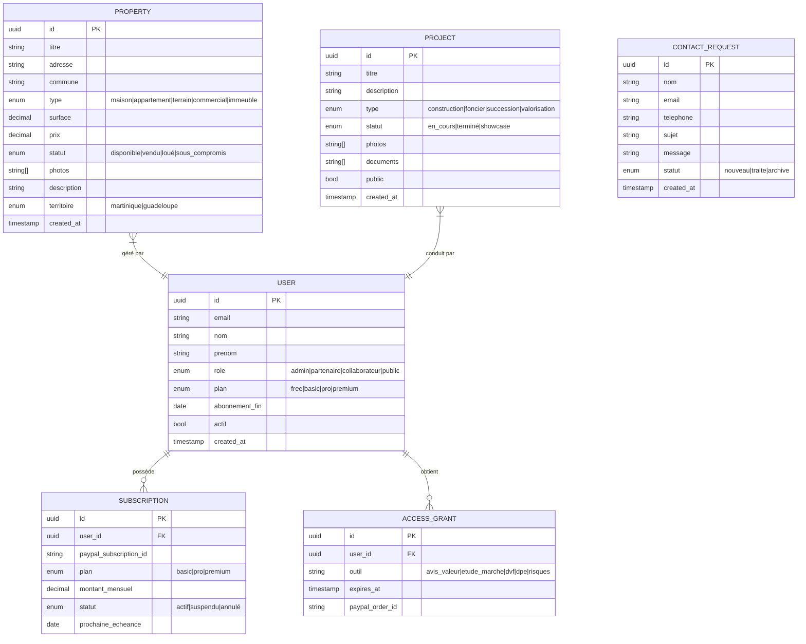
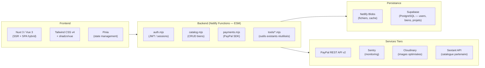
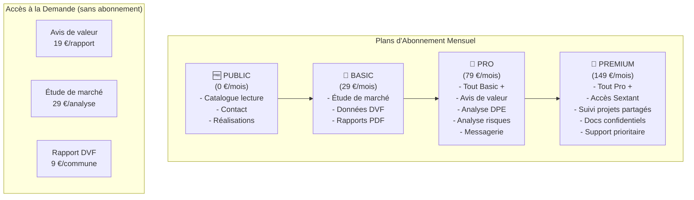
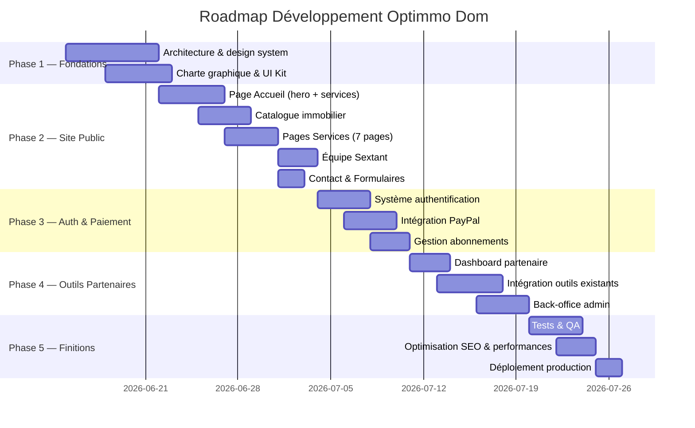

# Phase 1 — Vision & Architecture Globale
## Projet : Site Web Professionnel OPTIMMO DOM
**Version** : 1.0 · **Date** : 2026-06-10 · **Client** : Optimmo Dom / contact@fidiconseil.com

---

## 1. Identité & Positionnement

| Attribut | Valeur |
|---|---|
| **Nom** | Optimmo Dom |
| **Fondateur** | Franck Fidi |
| **Domaine** | fidiconseil.com |
| **Email** | contact@fidiconseil.com |
| **Slogan** | *L'excellence immobilière aux Antilles* |
| **Marchés** | Martinique · Guadeloupe |
| **Gamme** | Très haute gamme — consulting patrimonial |
| **Ton** | Élégant, confiant, expert, chaleureux |
| **Template** | Caribbean Luxury (choix validé) |

### Services Core
1. Conseil immobilier & transaction
2. Dénouement successoral
3. Valorisation de patrimoine
4. Développement foncier
5. Accompagnement projets de construction
6. Avis de valeur vénale
7. Étude de marché (Martinique / Guadeloupe)
8. Réseau Sextant (Franck Fidi, Philippe Marie-Luce, Lucien Fortuné)

### Équipe & URLs Sextant

| Agent | URL Sextant | Territoire |
|---|---|---|
| **Franck Fidi** | https://franck-fidi.sextantfrance.fr/fr/liste.htm#numnego=75011114 | Martinique & Guadeloupe |
| **Philippe Marie-Luce** | https://philippe-marie-luce.sextantfrance.fr/fr/liste.htm#numnego=75011175 | Guadeloupe |
| **Lucien Fortuné** | https://lucien-fortune.sextantfrance.fr/fr/liste.htm#numnego=75011408 | Martinique |

---

## 2. Architecture Macro du Site

---

## 3. Arborescence des Pages

---

## 4. Modèle de Données Principal

---

## 5. Stack Technique Recommandée

**Alternative légère (sans Nuxt)** : HTML + Vanilla JS + Alpine.js (pour cohérence avec l'existant `fidi-etude-marche`). Recommandé si budget/délai contraints.

---

## 6. Niveaux d'Accès Partenaires

---

## 7. Phases de Développement

---

## 8. Exigences Non-Fonctionnelles

| Critère | Exigence |
|---|---|
| **Performance** | LCP < 2.5s · CLS < 0.1 · FID < 100ms (Core Web Vitals) |
| **Mobile** | Responsive 320px → 4K · Touch-optimized |
| **Accessibilité** | WCAG 2.1 AA minimum |
| **SEO** | SSR · sitemap.xml · meta OG · Schema.org RealEstateListing |
| **Sécurité** | HTTPS · JWT HttpOnly · CORS strict · Rate limiting API |
| **Langues** | Français (principal) · Anglais (secondaire, phase 2) |
| **Navigateurs** | Chrome/Firefox/Safari/Edge — 2 dernières versions |
