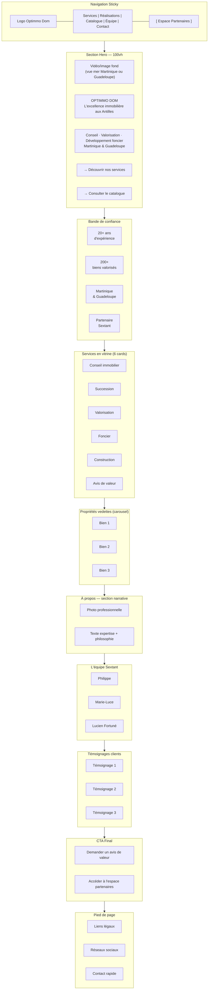
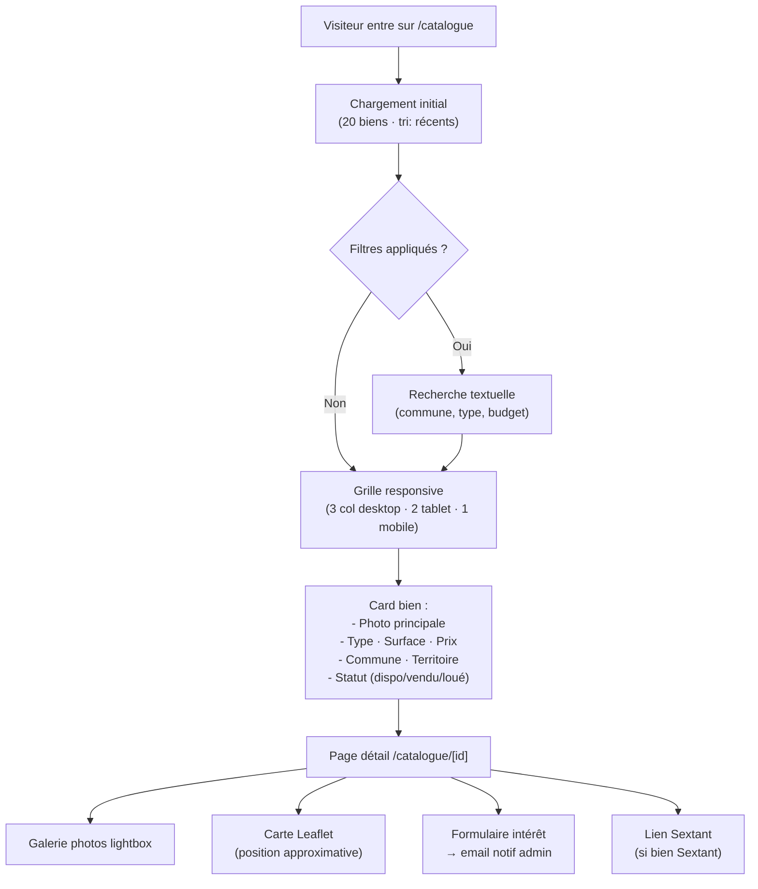
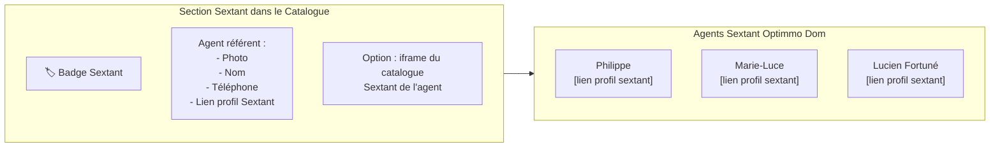
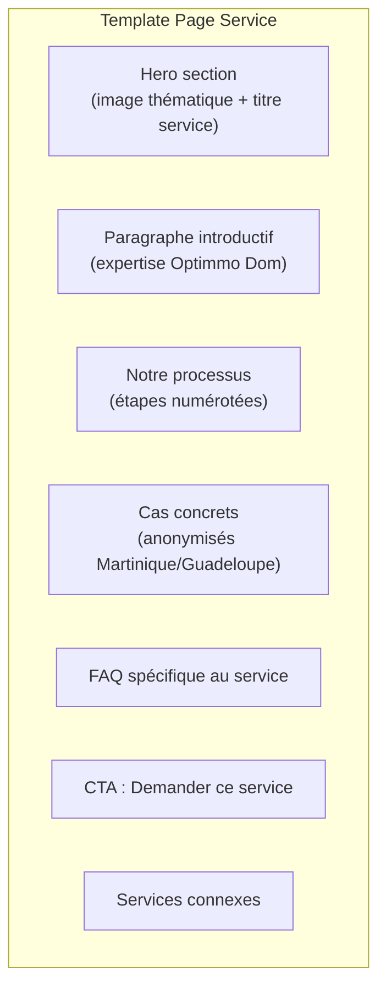
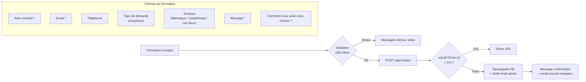

# Phase 2 — Espace Public : Pages & Composants
## Projet Optimmo Dom · Module Frontend Public

---

## 1. Page d'Accueil — Hero Premium

### Wireframe logique



### Pseudocode Composant Hero

```
COMPONENT HeroSection:
  STATE:
    - currentSlide: int = 0
    - slides: Array<{image, headline, cta}>

  COMPUTED:
    - backgroundStyle: CSS gradient overlay sur image/vidéo

  LIFECYCLE:
    onMounted → startSlideshow(interval=5000ms)

  RENDER:
    <section class="hero full-height relative">
      <MediaBackground [src=slides[currentSlide].image] />
      <div class="hero-content centered">
        <AnimatedLogo />
        <h1 class="display-xl gold-accent">{{ headline }}</h1>
        <p class="subtitle">{{ subline }}</p>
        <div class="cta-group">
          <PrimaryButton href="/services">Découvrir nos services</PrimaryButton>
          <SecondaryButton href="/catalogue">Voir le catalogue</SecondaryButton>
        </div>
      </div>
      <SlideIndicators [count=slides.length] [current=currentSlide] />
    </section>

  TDD_ANCHORS:
    - hero renders with background media ✓
    - CTA buttons navigate correctly ✓
    - Slideshow advances every 5s ✓
    - Pauses on hover ✓
    - Keyboard accessible ✓
```

---

## 2. Catalogue Immobilier

### Flow utilisateur



### Interface Sextant



### Pseudocode Catalogue

```
FUNCTION loadCatalogue(filters):
  INPUT: {
    type?: "maison|appartement|terrain|commercial|immeuble",
    territoire?: "martinique|guadeloupe",
    prix_min?: number,
    prix_max?: number,
    surface_min?: number,
    statut?: "disponible|tous",
    page: int = 1,
    per_page: int = 20
  }

  → CALL GET /api/catalog?{...filters}
  → RETURN { items: Property[], total: int, pages: int }

FUNCTION PropertyCard(property):
  RENDER:
    <article class="property-card" data-territoire={property.territoire}>
      <ImageSlider [images=property.photos] [lazy=true] />
      <div class="card-body">
        <span class="badge">{property.type}</span>
        <h3>{property.titre}</h3>
        <div class="meta">
          <span>{property.surface} m²</span>
          <span>{formatPrice(property.prix)}</span>
        </div>
        <p class="location">{property.commune} · {property.territoire}</p>
        <StatusBadge [statut=property.statut] />
        IF property.sextant_agent:
          <SextantBadge [agent=property.sextant_agent] />
      </div>
      <a href="/catalogue/{property.id}" class="card-link">Voir le détail →</a>
    </article>

TDD_ANCHORS:
  - filtres par type retournent uniquement le type demandé ✓
  - pagination fonctionne (page 2 = items 21-40) ✓
  - bien "vendu" affiche badge rouge ✓
  - images lazy-loaded ✓
  - lien Sextant s'ouvre dans nouvel onglet ✓
```

---

## 3. Pages Services (7 pages)

### Structure commune



### Matrice Services × Contenu

| Service | Process (étapes) | Outils liés | CTA principal |
|---|---|---|---|
| Conseil immobilier | 4 étapes | Catalogue, Étude marché | Prendre RDV |
| Dénouement successoral | 5 étapes | Avis de valeur, DVF | Consultation gratuite |
| Valorisation patrimoine | 4 étapes | Avis de valeur, DPE | Demande d'évaluation |
| Développement foncier | 6 étapes | Permis, Étude marché | Étude faisabilité |
| Projets de construction | 5 étapes | Permis, Entreprises | Contact projet |
| Avis de valeur | 3 étapes | Outil AV (partenaire) | Commander en ligne |
| Étude de marché | 4 étapes | Outil EM (partenaire) | Demander étude |

---

## 4. Section Équipe & Réseau Sextant

### Pseudocode Composant Équipe

```
COMPONENT TeamSection:
  DATA:
    members: [
      {
        nom: "Optimmo Dom / [Prénom Nom gérant]",
        role: "Fondateur & Expert Immobilier",
        specialites: ["Avis de valeur", "Étude de marché", "Succession"],
        territoire: ["Martinique", "Guadeloupe"],
        sextant_url: null,
        photo: "/images/team/gerant.jpg"
      },
      {
        nom: "Philippe",
        role: "Conseiller Sextant",
        specialites: [...],
        sextant_url: "https://www.sextant.immo/agent/philippe",
        photo: "/images/team/philippe.jpg"
      },
      {
        nom: "Marie-Luce",
        role: "Conseillère Sextant",
        sextant_url: "https://www.sextant.immo/agent/marie-luce",
        photo: "/images/team/marie-luce.jpg"
      },
      {
        nom: "Lucien Fortuné",
        role: "Conseiller Sextant",
        sextant_url: "https://www.sextant.immo/agent/lucien-fortune",
        photo: "/images/team/lucien-fortune.jpg"
      }
    ]

  RENDER:
    <section class="team">
      FOR EACH member IN members:
        <TeamCard
          [photo=member.photo]
          [nom=member.nom]
          [role=member.role]
          [tags=member.specialites]
          [sextant_link=member.sextant_url]
        />
```

---

## 5. Formulaire de Contact & Demandes



### Types de demandes (dropdown)
- Estimation / Avis de valeur
- Vente de bien
- Achat de bien
- Succession / Héritage
- Développement foncier
- Projet de construction
- Devenir partenaire
- Autre

---

## 6. SEO & Métadonnées

```
FUNCTION generateSEOMeta(page):
  SWITCH page.type:
    CASE "home":
      title: "Optimmo Dom — Conseil Immobilier Martinique & Guadeloupe"
      description: "Expert en immobilier aux Antilles : conseil, valorisation, dénouement successoral, avis de valeur. Martinique et Guadeloupe."
      og:image: "/images/og/optimmo-dom-home.jpg"

    CASE "service":
      title: "{service.nom} | Optimmo Dom Martinique Guadeloupe"
      description: "{service.meta_desc}"

    CASE "property":
      title: "{property.titre} — {property.commune} | Optimmo Dom"
      schema: RealEstateListing {
        "@type": "RealEstateListing",
        "name": property.titre,
        "address": { "@type": "PostalAddress", ... },
        "floorSize": { "@type": "QuantitativeValue", "value": property.surface },
        "price": property.prix
      }

  RETURN { title, description, og, schema }
```
