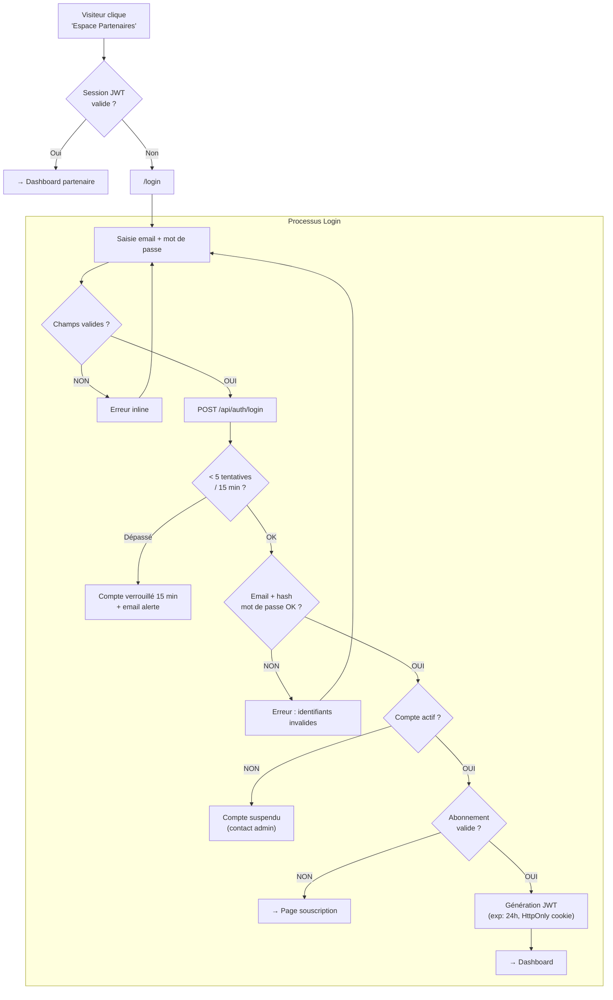
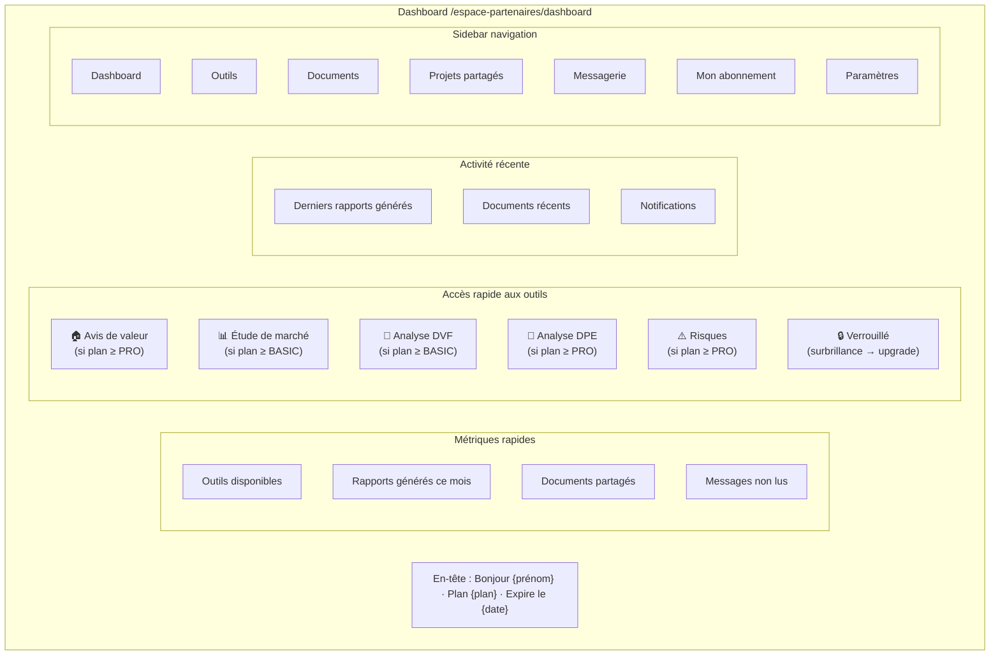
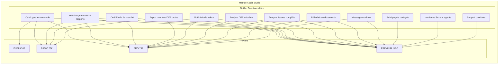
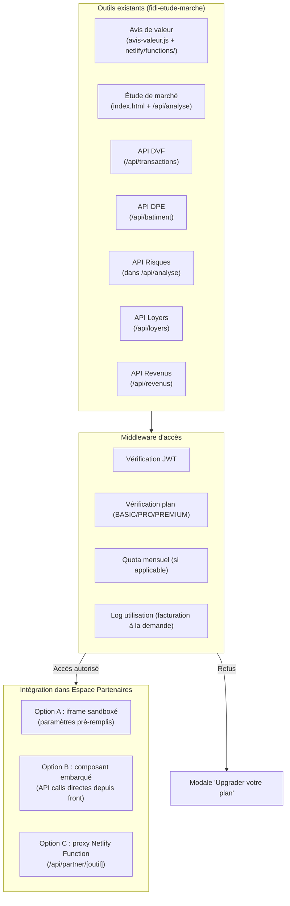
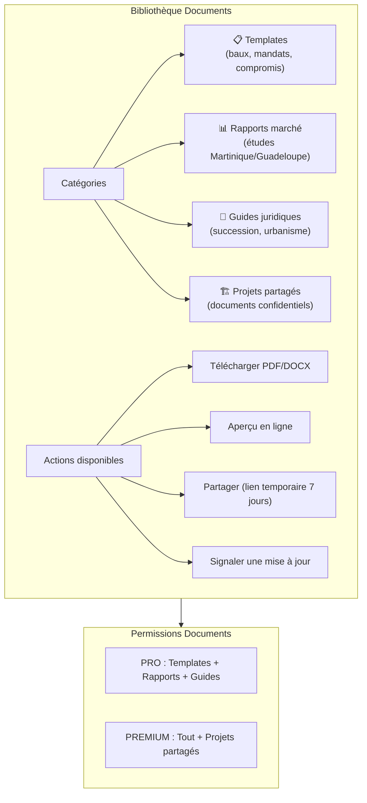
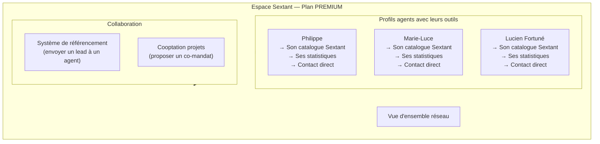

# Phase 3 — Espace Partenaires Sécurisé
## Projet Optimmo Dom · Module Accès Restreint & Outils Métier

---

## 1. Flow d'Authentification Complet



---

## 2. Dashboard Partenaire — Structure



---

## 3. Matrice des Droits par Plan



### Tableau récapitulatif

| Fonctionnalité | PUBLIC | BASIC | PRO | PREMIUM |
|---|:---:|:---:|:---:|:---:|
| Catalogue (lecture) | ✅ | ✅ | ✅ | ✅ |
| Rapports PDF | ❌ | ✅ | ✅ | ✅ |
| Étude de marché | ❌ | ✅ | ✅ | ✅ |
| Données DVF export | ❌ | ✅ | ✅ | ✅ |
| Avis de valeur | ❌ | ❌ | ✅ | ✅ |
| Analyse DPE | ❌ | ❌ | ✅ | ✅ |
| Analyse risques | ❌ | ❌ | ✅ | ✅ |
| Bibliothèque docs | ❌ | ❌ | ✅ | ✅ |
| Messagerie admin | ❌ | ❌ | ✅ | ✅ |
| Suivi projets | ❌ | ❌ | ❌ | ✅ |
| Accès Sextant | ❌ | ❌ | ❌ | ✅ |
| Support prioritaire | ❌ | ❌ | ❌ | ✅ |

---

## 4. Intégration des Outils Existants



### Pseudocode Middleware d'accès aux outils

```
FUNCTION checkToolAccess(req, tool):
  INPUT:
    req.cookies.jwt_token: string
    tool: "avis_valeur|etude_marche|dvf|dpe|risques"

  REQUIRED_PLAN = {
    "etude_marche": "basic",
    "dvf": "basic",
    "avis_valeur": "pro",
    "dpe": "pro",
    "risques": "pro"
  }

  STEP 1 — Vérifier JWT:
    token = verifyJWT(req.cookies.jwt_token)
    IF !token → RETURN 401 { error: "Non authentifié" }

  STEP 2 — Charger l'utilisateur:
    user = await db.users.findById(token.userId)
    IF !user.actif → RETURN 403 { error: "Compte suspendu" }

  STEP 3 — Vérifier l'abonnement:
    subscription = await db.subscriptions.findActiveByUser(user.id)
    IF !subscription:
      oneshot = await db.access_grants.findValid(user.id, tool)
      IF !oneshot → RETURN 402 { error: "Accès requis", redirect: "/abonnement" }

  STEP 4 — Vérifier le niveau de plan:
    plan_level = { "basic": 1, "pro": 2, "premium": 3 }
    required_level = plan_level[REQUIRED_PLAN[tool]]
    user_level = plan_level[subscription.plan]
    IF user_level < required_level:
      RETURN 403 {
        error: "Plan insuffisant",
        required_plan: REQUIRED_PLAN[tool],
        current_plan: subscription.plan
      }

  STEP 5 — Logger l'utilisation:
    await db.usage_logs.create({
      user_id: user.id,
      tool: tool,
      timestamp: now()
    })

  RETURN { authorized: true, user, subscription }

TDD_ANCHORS:
  - user sans JWT → 401 ✓
  - user actif plan BASIC → accès DVF OK ✓
  - user actif plan BASIC → accès avis_valeur → 403 ✓
  - user plan PRO → accès avis_valeur OK ✓
  - token expiré → 401 ✓
  - user avec one-shot avis_valeur non expiré → accès OK ✓
```

---

## 5. Bibliothèque de Documents



---

## 6. Espace Sextant (PREMIUM uniquement)



---

## 7. Pseudocode Dashboard Principal

```
COMPONENT PartnerDashboard:
  STATE:
    user: User
    subscription: Subscription | null
    recentReports: Report[]
    notifications: Notification[]
    unreadMessages: int

  LIFECYCLE:
    onMounted:
      await Promise.all([
        fetchUserProfile(),
        fetchSubscription(),
        fetchRecentReports(limit=5),
        fetchNotifications(limit=10),
        fetchUnreadCount()
      ])

  RENDER:
    <main class="dashboard">
      <DashboardHeader
        [user=user]
        [plan=subscription?.plan ?? "none"]
        [expiresAt=subscription?.prochaine_echeance]
      />

      <KPIRow>
        <KPICard icon="🔧" label="Outils disponibles" value={countTools(subscription)} />
        <KPICard icon="📄" label="Rapports ce mois" value={recentReports.length} />
        <KPICard icon="✉️" label="Messages" value={unreadMessages} alert={unreadMessages > 0} />
      </KPIRow>

      <ToolGrid [plan=subscription?.plan] [onLockedClick=showUpgradeModal] />

      <RecentActivity [reports=recentReports] [notifications=notifications] />

      IF !subscription OR subscription.statut == "expiré":
        <UpgradeBanner />
    </main>

FUNCTION countTools(subscription):
  IF !subscription → RETURN 0
  SWITCH subscription.plan:
    "basic"   → RETURN 4
    "pro"     → RETURN 9
    "premium" → RETURN 12
```
