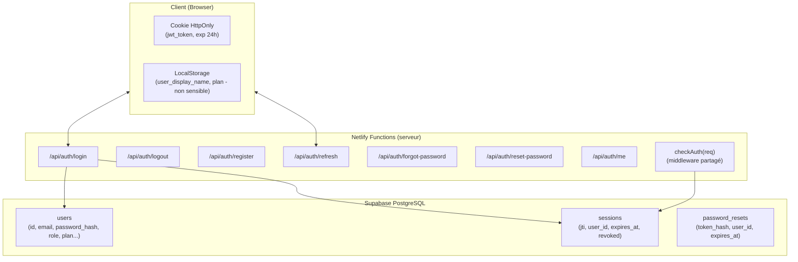
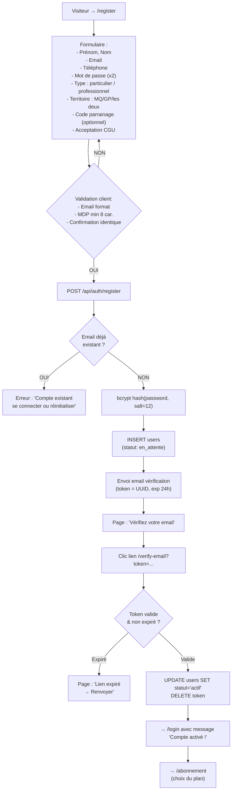
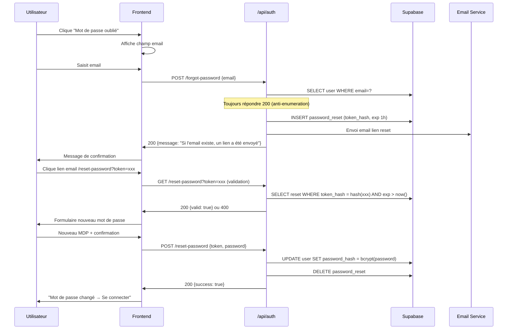
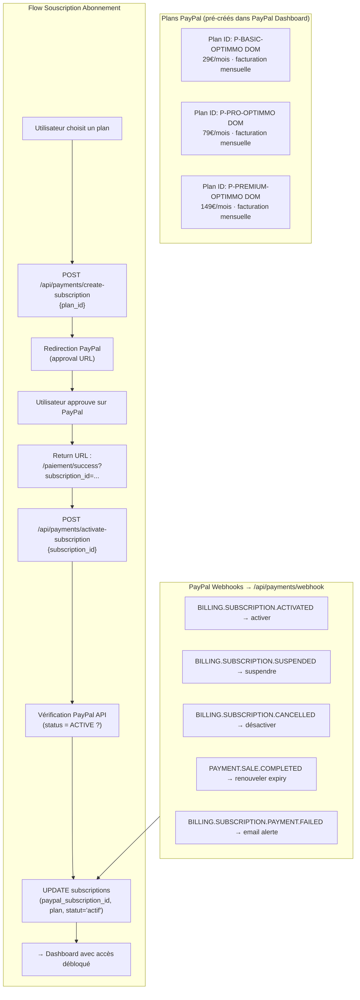
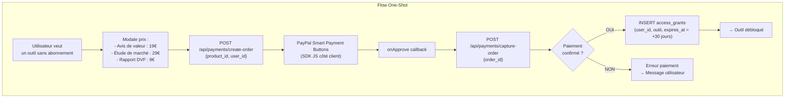

# Phase 4 — Authentification & Paiement PayPal
## Projet Optimmo Dom · Module Sécurité & Monétisation

---

## 1. Architecture d'Authentification



---

## 2. Flow Complet d'Inscription



---

## 3. Réinitialisation de Mot de Passe



---

## 4. Architecture PayPal — Abonnements



---

## 5. Architecture PayPal — Accès à la Demande (One-Shot)



---

## 6. Pseudocode Netlify Functions Paiement

```
// netlify/functions/payments-create-subscription.mjs
FUNCTION handler(event):
  IF event.httpMethod != "POST" → RETURN 405

  user = await checkAuth(event)  // middleware JWT
  IF !user → RETURN 401

  body = JSON.parse(event.body)
  plan_id = body.plan_id

  VALID_PLANS = {
    "basic":   env.PAYPAL_PLAN_ID_BASIC,
    "pro":     env.PAYPAL_PLAN_ID_PRO,
    "premium": env.PAYPAL_PLAN_ID_PREMIUM
  }

  IF plan_id NOT IN VALID_PLANS → RETURN 400

  // Appel PayPal API v2
  paypal_token = await getPayPalAccessToken()
  subscription = await paypalAPI.POST("/v1/billing/subscriptions", {
    plan_id: VALID_PLANS[plan_id],
    subscriber: {
      email_address: user.email,
      name: { given_name: user.prenom, surname: user.nom }
    },
    application_context: {
      return_url: env.BASE_URL + "/paiement/success",
      cancel_url: env.BASE_URL + "/paiement/annule"
    }
  })

  RETURN 200 {
    subscription_id: subscription.id,
    approval_url: subscription.links.find(l => l.rel=="approve").href
  }

// netlify/functions/payments-webhook.mjs
FUNCTION handler(event):
  // Vérification signature PayPal (CRITIQUE sécurité)
  isValid = verifyPayPalWebhook(event.headers, event.body)
  IF !isValid → RETURN 400

  payload = JSON.parse(event.body)
  subscription_id = payload.resource.id

  SWITCH payload.event_type:
    CASE "BILLING.SUBSCRIPTION.ACTIVATED":
      await db.subscriptions.update({
        paypal_subscription_id: subscription_id,
        statut: "actif"
      })
      await sendEmail(user.email, "Votre abonnement Optimmo Dom est activé !")

    CASE "BILLING.SUBSCRIPTION.CANCELLED":
      await db.subscriptions.update({
        paypal_subscription_id: subscription_id,
        statut: "annulé"
      })
      // Accès conservé jusqu'à la fin de la période payée

    CASE "BILLING.SUBSCRIPTION.PAYMENT.FAILED":
      await db.subscriptions.update({ statut: "suspendu" })
      await sendEmail(user.email, "Problème de paiement — Mettre à jour")

    CASE "PAYMENT.SALE.COMPLETED":
      sub = await db.subscriptions.findByPayPalId(subscription_id)
      await db.subscriptions.update({
        prochaine_echeance: addMonths(now(), 1)
      })

  RETURN 200

TDD_ANCHORS:
  - création abonnement BASIC retourne approval_url ✓
  - plan invalide → 400 ✓
  - webhook sans signature valide → 400 ✓
  - webhook CANCELLED → statut annulé en DB ✓
  - one-shot paiement capturé → access_grant créé ✓
  - access_grant expiré → accès refusé ✓
```

---

## 7. Variables d'Environnement Requises

```
# Supabase
SUPABASE_URL=https://xxx.supabase.co
SUPABASE_ANON_KEY=eyJ...
SUPABASE_SERVICE_KEY=eyJ...  (functions serveur uniquement)

# JWT
JWT_SECRET=<256-bit random secret>
JWT_EXPIRY=86400  # 24h en secondes

# PayPal
PAYPAL_CLIENT_ID=AYm...
PAYPAL_CLIENT_SECRET=EGj...
PAYPAL_PLAN_ID_BASIC=P-xxx
PAYPAL_PLAN_ID_PRO=P-xxx
PAYPAL_PLAN_ID_PREMIUM=P-xxx
PAYPAL_WEBHOOK_ID=xxx  # pour vérification signature

# Email (Resend ou SendGrid)
EMAIL_API_KEY=re_xxx
EMAIL_FROM=contact@optimmo-dom.fr

# App
BASE_URL=https://optimmo-dom.fr
PAPPERS_API_KEY=xxx  # hérité fidi-etude-marche
```

---

## 8. Page de Choix de Plan

```
COMPONENT PricingPage:
  STATE:
    selectedPlan: "basic"|"pro"|"premium" = "pro"
    billingCycle: "monthly" = "monthly"  // v2: "annual" avec -20%
    loading: bool = false

  RENDER:
    <section class="pricing">
      <h2>Choisissez votre accès</h2>
      <BillingToggle [value=billingCycle] [onChange=setBillingCycle] />

      <div class="pricing-grid">
        FOR EACH plan IN [basic, pro, premium]:
          <PricingCard
            [plan=plan]
            [price=getPrice(plan, billingCycle)]
            [features=PLAN_FEATURES[plan]]
            [highlighted=plan=="pro"]
            [selected=selectedPlan==plan]
            [onSelect=() => selectedPlan = plan]
          />
      </div>

      <div class="oneshot-section">
        <h3>Accès à la demande (sans abonnement)</h3>
        <OneShotCard outil="avis_valeur" price="19€" />
        <OneShotCard outil="etude_marche" price="29€" />
        <OneShotCard outil="dvf" price="9€" />
      </div>

      <PrimaryButton
        [loading=loading]
        [onClick=initPayment]
      >
        Commencer avec {selectedPlan} — {getPrice(selectedPlan)}€/mois
      </PrimaryButton>

      <p class="legal">
        Sans engagement · Annulation à tout moment · Paiement sécurisé PayPal
      </p>
    </section>
```
