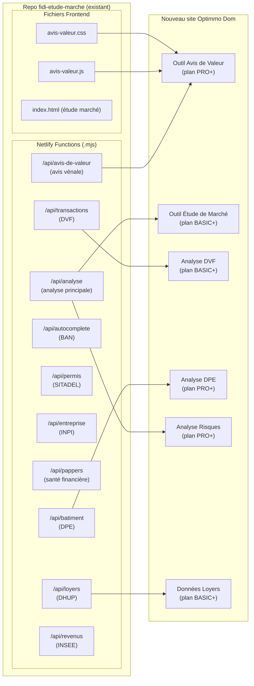
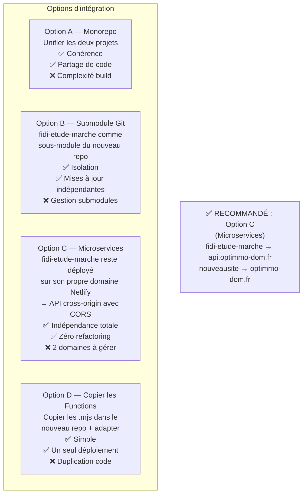
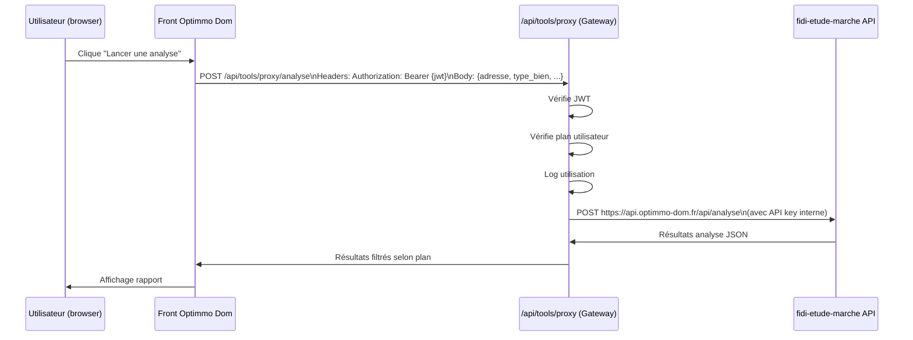
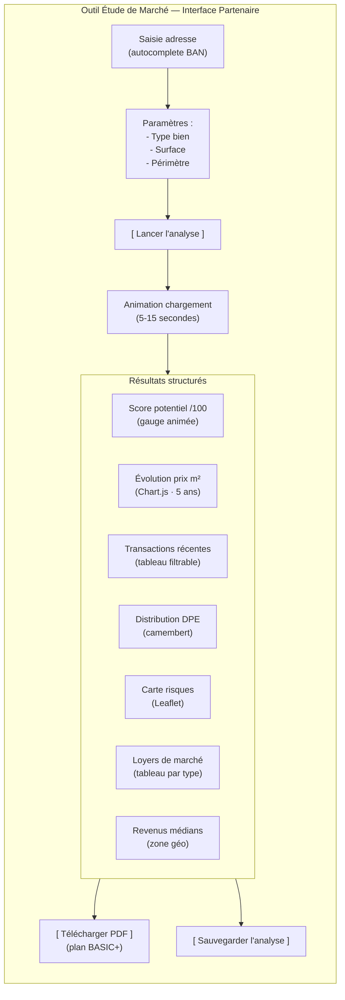
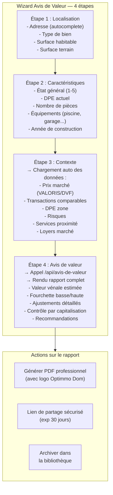
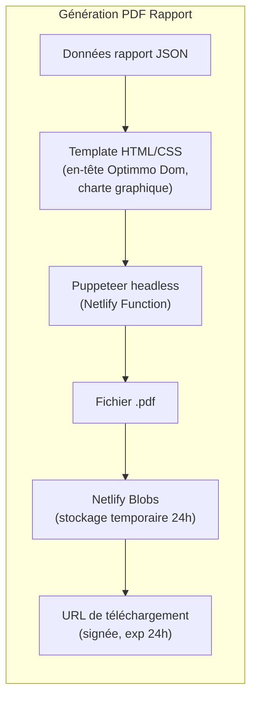

# Phase 5 — Intégration des Outils Existants
## Projet Optimmo Dom · Réutilisation fidi-etude-marche

---

## 1. Cartographie des Outils à Intégrer



---

## 2. Stratégie d'Intégration



### Pourquoi l'Option C est recommandée

1. Les Netlify Functions `fidi-etude-marche` fonctionnent déjà en production
2. Zéro risque de régression sur les outils existants
3. L'espace partenaires appelle les APIs via HTTPS (déjà CORS-enabled)
4. Mise à jour possible de chaque repo indépendamment
5. Coût Netlify: même tier gratuit sur les deux repos

---

## 3. Configuration CORS pour Appels Cross-Origin

```javascript
// À ajouter dans chaque function fidi-etude-marche
// netlify/functions/_cors.mjs

export const ALLOWED_ORIGINS = [
  "https://optimmo-dom.fr",
  "https://www.optimmo-dom.fr",
  "http://localhost:3000",  // dev
  "http://localhost:8888"   // netlify dev
]

export function corsHeaders(origin) {
  const allowed = ALLOWED_ORIGINS.includes(origin) ? origin : ALLOWED_ORIGINS[0]
  return {
    "Access-Control-Allow-Origin": allowed,
    "Access-Control-Allow-Headers": "Content-Type, Authorization",
    "Access-Control-Allow-Methods": "GET, POST, OPTIONS",
    "Access-Control-Max-Age": "86400"
  }
}
```

---

## 4. Proxy Gateway — Authentification des Appels Outils



### Pseudocode Gateway

```
// netlify/functions/tools-proxy.mjs
FUNCTION handler(event):
  // STEP 1 — Auth
  user = await checkAuth(event)
  IF !user → RETURN 401

  // STEP 2 — Router
  path_parts = event.path.split("/")
  tool_name = path_parts[path_parts.length - 1]
  // tool_name = "analyse" | "transactions" | "batiment" | etc.

  // STEP 3 — Vérification plan
  access = await checkToolAccess(user, toolNameToKey(tool_name))
  IF !access.authorized → RETURN 403 { upgrade_required: access.required_plan }

  // STEP 4 — Proxy vers API fidi
  FIDI_BASE = env.FIDI_API_URL  // https://fidi-etude-marche.netlify.app
  FIDI_API_KEY = env.FIDI_INTERNAL_KEY  // Header X-Internal-Key pour sécuriser

  targetUrl = FIDI_BASE + "/api/" + tool_name
  body = event.body
  method = event.httpMethod

  response = await fetch(targetUrl, {
    method: method,
    headers: {
      "Content-Type": "application/json",
      "X-Internal-Key": FIDI_API_KEY,
      "X-User-Plan": access.subscription.plan,
      "X-User-Id": user.id
    },
    body: method != "GET" ? body : undefined
  })

  data = await response.json()

  // STEP 5 — Filtrer selon plan
  filtered_data = filterDataByPlan(data, access.subscription.plan)

  // STEP 6 — Sauvegarder rapport si applicable
  IF tool_name IN ["analyse", "avis-de-valeur"]:
    await saveReport(user.id, tool_name, filtered_data)

  RETURN response.status, filtered_data

FUNCTION filterDataByPlan(data, plan):
  IF plan == "basic":
    // Masquer les comparables détaillés dans les avis de valeur
    // Limiter DVF aux 12 derniers mois
    RETURN omit(data, ["comparables_detail", "scoring_detail"])
  IF plan == "pro":
    // Accès complet sauf export brut
    RETURN omit(data, ["raw_dvf_transactions"])
  IF plan == "premium":
    RETURN data  // Accès total
```

---

## 5. Outil Étude de Marché (intégré)



---

## 6. Outil Avis de Valeur (intégré)



---

## 7. Génération PDF — Architecture



### Alternative légère : `@react-pdf/renderer` ou `jsPDF` côté client
(évite la function serveur lourde avec Puppeteer)

---

## 8. Tableau de Bord Analytics (Admin)

```
COMPONENT AdminAnalytics:
  DATA (agrégé, pas de données personnelles brutes):
    - nb_users_actifs_ce_mois: int
    - revenus_mensuels: { basic: €, pro: €, premium: €, oneshot: € }
    - outils_utilises: { analyse: n, avis_valeur: n, dvf: n }
    - conversions: { visite→inscription: %, inscription→paiement: % }
    - rapports_generes: int
    - churn_rate: %

  CHARTS:
    - Courbe revenus M-12
    - Répartition plans (donut)
    - Top outils utilisés (barres)
    - Carte géo utilisateurs (Martinique vs Guadeloupe)

TDD_ANCHORS:
  - analytics visibles uniquement rôle "admin" ✓
  - données agrégées (RGPD) ✓
  - calcul churn rate correct sur 30j ✓
```
