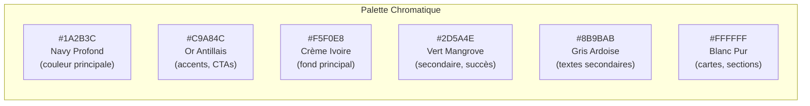
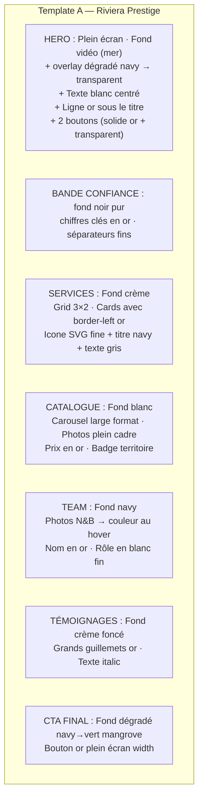
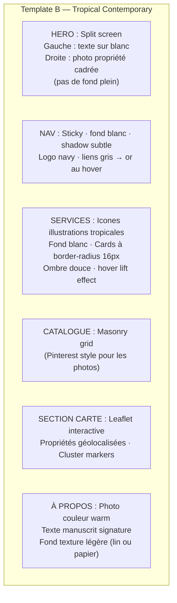
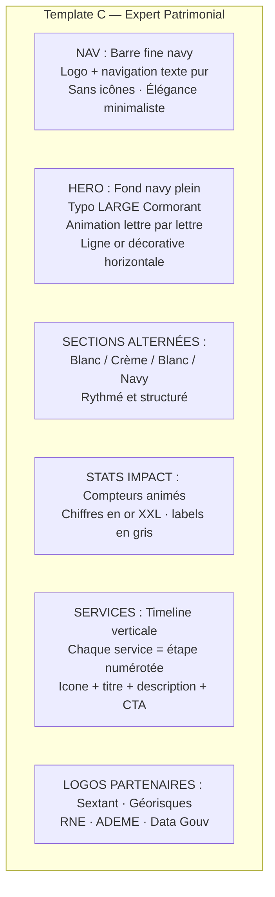
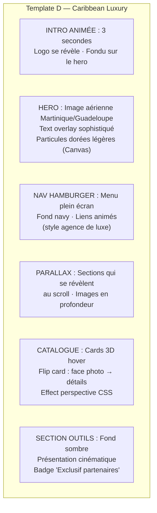
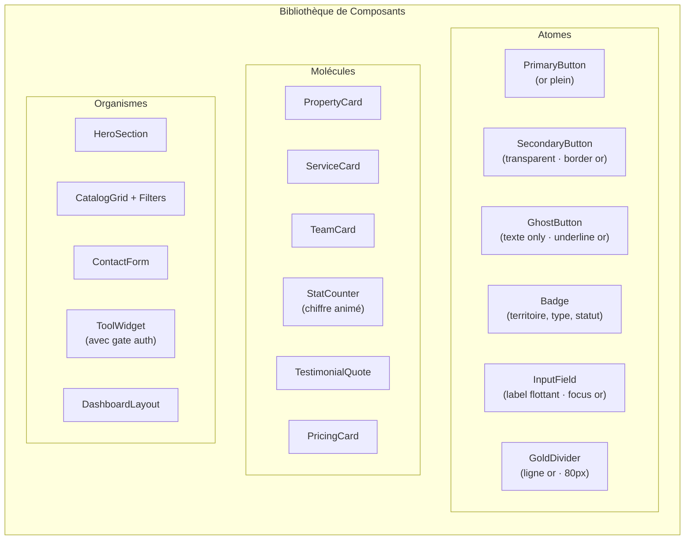
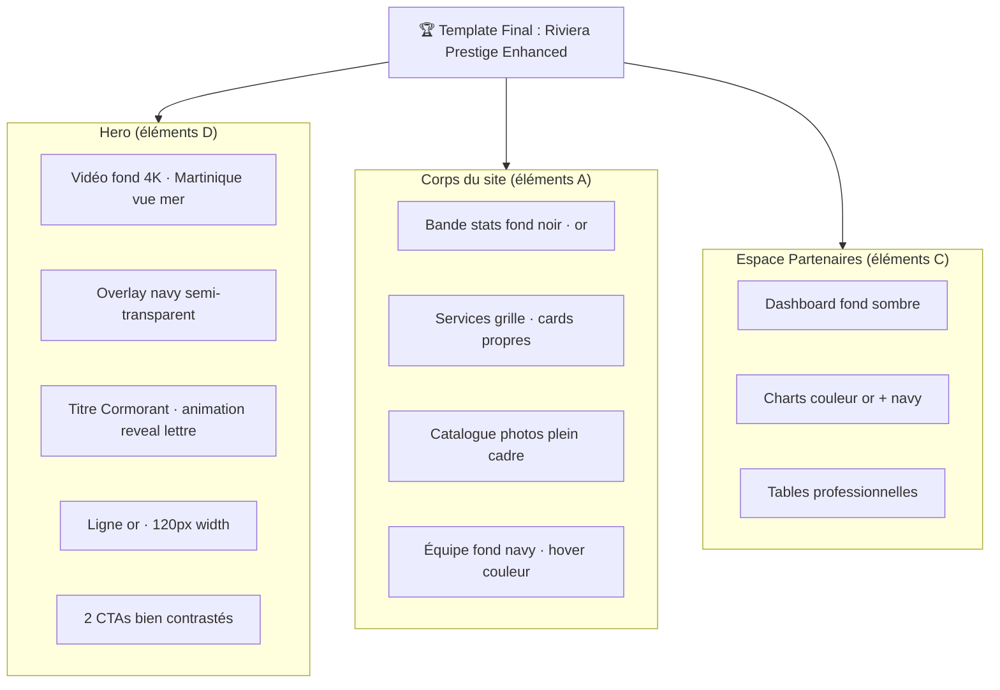

# Phase 6 — Design System & Propositions de Templates
## Projet Optimmo Dom · Identité Visuelle Très Haute Gamme

---

## 1. Identité Visuelle Optimmo Dom

### Philosophie Design
> Élégance des Antilles · Expertise patrimoniale · Confiance absolue

Le design doit évoquer :
- La **lumière caraïbe** (sans être cliché touristique)
- La **rigueur professionnelle** d'un cabinet d'expertise parisien
- La **chaleur humaine** des relations locales martiniquaises/guadeloupéennes
- La **modernité discrète** d'un acteur haut de gamme

---

## 2. Système de Couleurs



### Palette complète

| Nom | Hex | Usage |
|---|---|---|
| **Navy Profond** | `#1A2B3C` | Header, footer, textes titres |
| **Navy Moyen** | `#243447` | Hover states, dividers |
| **Or Antillais** | `#C9A84C` | CTA primaires, badges prestige, underlines |
| **Or Clair** | `#E8C96A` | Hover gold, highlights |
| **Crème Ivoire** | `#F5F0E8` | Background global |
| **Crème Foncée** | `#EDE7D9` | Section alternée |
| **Vert Mangrove** | `#2D5A4E` | Success, nature, foncier |
| **Vert Clair** | `#3D7A68` | Hover vert |
| **Gris Ardoise** | `#8B9BAB` | Body text secondaire |
| **Blanc Pur** | `#FFFFFF` | Cards, formulaires |
| **Alerte** | `#C0392B` | Erreurs, urgence |

### Application des couleurs

```
MODE CLAIR (défaut):
  body background: #F5F0E8
  cards: #FFFFFF
  titres: #1A2B3C
  texte: #333D47
  accent: #C9A84C
  hover: #E8C96A

MODE SOMBRE (option espace partenaires):
  body background: #0F1923
  cards: #1A2B3C
  titres: #F5F0E8
  texte: #8B9BAB
  accent: #C9A84C
```

---

## 3. Typographie

| Usage | Famille | Poids | Taille |
|---|---|---|---|
| Logo / Brand | **Cormorant Garamond** | 600 | Variable |
| Titres H1 | **Cormorant Garamond** | 600 | 56-72px |
| Titres H2 | **Cormorant Garamond** | 500 | 40-48px |
| Titres H3 | **Playfair Display** | 500 | 28-32px |
| Sous-titres | **Raleway** | 400 italic | 18-20px |
| Corps de texte | **Lato** | 400 | 16px |
| UI / Labels | **Lato** | 700 | 13-14px |
| Data / Chiffres | **Lato Mono** | 400 | Variable |

### Règles typographiques
- Line height corps: 1.7
- Letter-spacing titres: 0.02-0.05em
- Espacement entre sections: 120px desktop / 80px mobile
- Utiliser `text-transform: uppercase` + `letter-spacing: 0.15em` pour les labels de section

---

## 4. Propositions de Templates

### Option A — "Riviera Prestige" ⭐ RECOMMANDÉ



**Inspiration** : Sotheby's International Realty · Christie's Real Estate
**Forces** : Luxe intemporel · Fonctionne très bien sur mobile · Photographie au centre
**Implémentation** : HTML + Tailwind CSS v4 + Alpine.js (cohérent avec l'existant)

---

### Option B — "Tropical Contemporary"



**Inspiration** : Propriétés privées · Belles Demeures · Côté Maisons
**Forces** : Très vivant · Bon pour le catalogue · Moderne sans être froid
**Implémentation** : Nuxt 3 + Tailwind + Swiper.js

---

### Option C — "Expert Patrimonial"



**Inspiration** : Cabinets d'avocats · Notaires · Experts immobiliers parisiens
**Forces** : Crédibilité maximale · Idéal pour la partie B2B / partenaires
**Implémentation** : HTML + GSAP (animations) + CSS Grid

---

### Option D — "Caribbean Luxury" (la plus audacieuse)



**Inspiration** : Dolce & Gabbana Real Estate · Christophe Charre Immobilier
**Forces** : Impact mémorable · Se démarque totalement de la concurrence
**Risques** : Temps de développement plus long · Animations = perf mobile à surveiller

---

## 5. Composants UI Réutilisables



---

## 6. Animations & Micro-interactions

```
ANIMATION_SYSTEM:
  // Entrées au scroll (Intersection Observer)
  fade-in-up:
    initial: { opacity: 0, y: 30px }
    animate: { opacity: 1, y: 0 }
    duration: 600ms · easing: ease-out

  // Compteurs chiffres clés
  count-up:
    duration: 2000ms · easing: ease-out
    start: 0 · end: valeur cible
    trigger: IntersectionObserver threshold=0.5

  // Cards catalogue
  card-hover:
    transform: translateY(-8px)
    box-shadow: 0 20px 40px rgba(26,43,60,0.15)
    transition: 250ms ease

  // Gold underline sur les liens nav
  nav-link-underline:
    width: 0 → 100% au hover
    height: 2px
    background: #C9A84C
    transition: 300ms ease

  // Bouton CTA
  button-pulse:
    box-shadow: 0 0 0 0 rgba(201,168,76,0.4)
    animation: pulse 2s infinite (avant le premier clic)

RÈGLES:
  - prefers-reduced-motion → désactiver toutes les animations
  - Aucune animation > 600ms sauf intro/loader
  - Jamais de GIF ou animations continues intrusives
```

---

## 7. Responsive Breakpoints

```
BREAKPOINTS:
  xs:  < 480px   (petits mobiles)
  sm:  480-767px (mobiles)
  md:  768-1023px (tablettes)
  lg:  1024-1279px (laptop)
  xl:  1280-1535px (desktop)
  2xl: ≥ 1536px  (grands écrans)

ADAPTATIONS MOBILES CRITIQUES:
  - Nav hamburger dès md
  - Hero : texte réduit à 80%, CTA full-width
  - Catalogue : 1 colonne sur xs/sm
  - Dashboard : sidebar collapse → bottom navigation
  - Outils : steps verticaux plein écran
  - Wizard AV : un step à la fois, barre de progression
```

---

## 8. Template Sélectionné & Implémentation

### Recommandation finale

**Template A "Riviera Prestige"** avec des éléments de **Template D** pour le hero :



### Plan de fichiers CSS

```
optimmo-dom-website/
├── styles/
│   ├── tokens.css          # Variables CSS (couleurs, typo, espacements)
│   ├── base.css            # Reset + typographie globale
│   ├── components/
│   │   ├── buttons.css
│   │   ├── cards.css
│   │   ├── forms.css
│   │   ├── nav.css
│   │   └── badges.css
│   ├── sections/
│   │   ├── hero.css
│   │   ├── catalog.css
│   │   ├── team.css
│   │   └── pricing.css
│   ├── pages/
│   │   ├── home.css
│   │   ├── services.css
│   │   └── dashboard.css
│   └── utilities.css       # Classes utilitaires custom
```

---

## 9. Inspiration Sites de Référence

| Site | Ce qu'on retient |
|---|---|
| **sothebysrealty.com** | Fullscreen properties, typographie raffinée |
| **christiesrealestate.com** | Structure très propre, confiance immédiate |
| **proprietes-privees.com** | Catalogue FR, fonctionnalités recherche |
| **beauties.fr** | Qualité photographique, galeries |
| **century21.fr** | Ergonomie recherche, filtres mobiles |
| **sextant.immo** | Cohérence réseau, profils agents (à compléter) |
